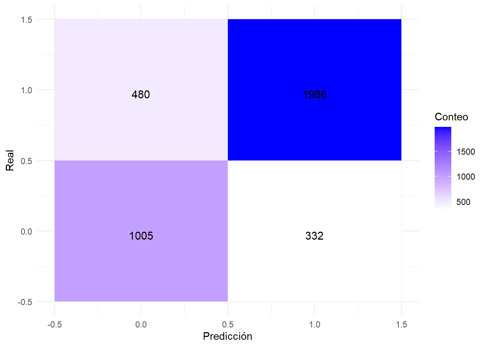
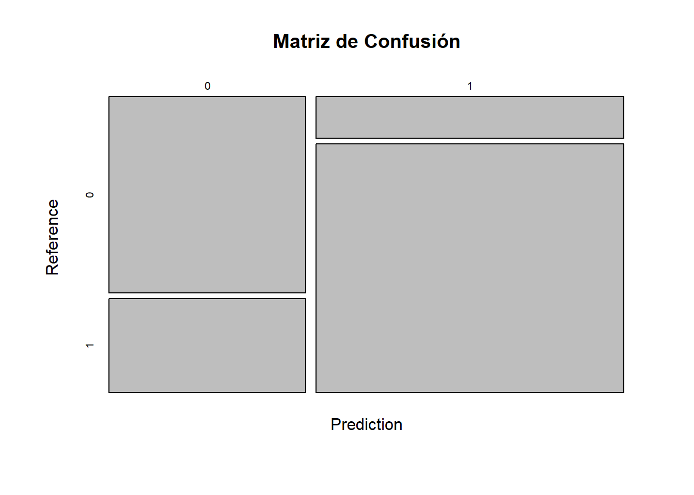
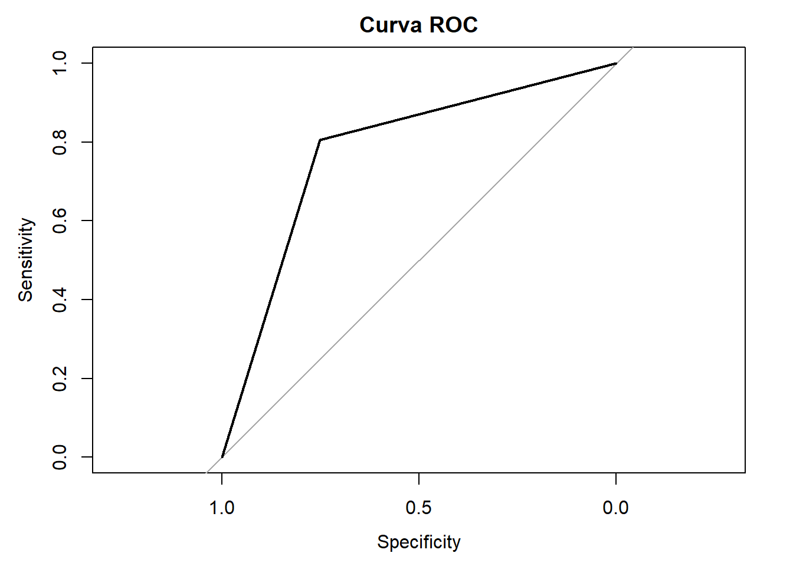
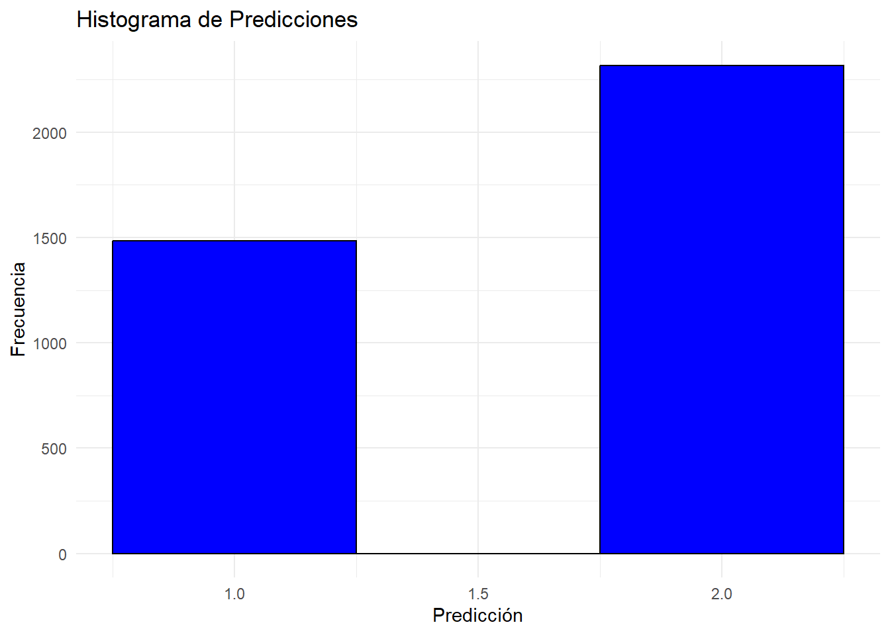

#### **Introduction**

El dataset MAGIC Gamma Telescope contiene eventos de rayos gamma y eventos de fondo hadrónicos. El problema consiste en diferenciar entre estos dos tipos de eventos utilizando las características medidas por el telescopio

## Variables del Dataset

-   **`fLength`**: Longitud del eje mayor elíptico del evento.
-   **`fWidth`**: Ancho del eje mayor elíptico del evento.
-   **`fSize`**: Tamaño del evento en términos de número de píxeles.
-   **`fConc`**: Concentración del evento (cuán concentrado está el evento dentro del área de detección).
-   **`fConc1`**: Concentración en un área más pequeña del evento.
-   **`fConc2`**: Otra medida de concentración.
-   **`fAlpha`**: Ángulo entre el eje mayor del evento y la dirección del impacto.
-   **`fDist`**: Distancia del evento al centro de la imagen.
-   **`fShower`**: Forma del evento en términos de dispersión.
-   **`fRlength`**: Longitud de la línea recta a través del evento.
-   **`class`**: Etiqueta del evento, donde `g` representa rayos gamma y `h` representa eventos hadrónicos.

##### *k-Nearest Neighbors (k-NN) clasifica datos según las etiquetas de sus k vecinos más cercanos, utilizando una métrica de distancia*


::: {.cell}

:::


## Explora nuestro análisis detallado en Quarto

## Exploración de Datos


::: {.cell}

```{.r .cell-code}
# Cargar librerías necesarias DMWR para equilibrar las clases
library(dplyr)
library(ggplot2)
library(caret)
library(DMwR)  # Para el balanceo de clases
library(readr)  # Para leer el archivo CSV
```
:::

::: {.cell}

```{.r .cell-code}
#  los nombres de las columnas
cols <- c("fLength", "fWidth", "fSize", "fConc", "fConc1", "fAsym", "fM3Long", "fM3Trans", "fAlpha", "fDist", "class")

# Cargar el dataset y etiqueta las columnas
df <- read.csv("magic04.data", header = FALSE, col.names = cols)
```
:::


# Análisis exploratorio de los datos


::: {.cell}

```{.r .cell-code}
# Crear una copia para análisis exploratorio
df_exploratory <- df
```
:::

::: {.cell}

```{.r .cell-code}
# observacion visualizacion datos
summary(df_exploratory[c("fSize", "fConc")])  # Seleccionar variables específicas para summary()
```

::: {.cell-output .cell-output-stdout}

```
     fSize           fConc       
 Min.   :1.941   Min.   :0.0131  
 1st Qu.:2.477   1st Qu.:0.2358  
 Median :2.740   Median :0.3542  
 Mean   :2.825   Mean   :0.3803  
 3rd Qu.:3.102   3rd Qu.:0.5037  
 Max.   :5.323   Max.   :0.8930  
```


:::

```{.r .cell-code}
str(df_exploratory[c("fSize", "fConc")])  # Seleccionar variables específicas para str()
```

::: {.cell-output .cell-output-stdout}

```
'data.frame':	19020 obs. of  2 variables:
 $ fSize: num  2.64 2.52 4.06 2.34 3.16 ...
 $ fConc: num  0.3918 0.5303 0.0374 0.6147 0.3168 ...
```


:::

```{.r .cell-code}
# Visualización sencilla
ggplot(df_exploratory, aes(x = fSize, fill = class)) +
    geom_histogram(binwidth = 0.5, position = "dodge") +
    labs(title = "Distribución de Tamaño de Evento por Clase",
         x = "Tamaño del Evento",
         y = "Frecuencia")
```

::: {.cell-output-display}
{width=672}
:::
:::

fSize: La media 2.83 es un poco mayor que la mediana 2.740, indicando tamaños tendiendo hacia valores más grandes, el máximo es 5.323.

fConc: La media 0.38 es ligeramente mayor que la mediana (0.3542), mostrando que la mayoría de las concentraciones están en el rango inferior, el máximo es 0.8930.


## Preprocesamiento


::: {.cell}

```{.r .cell-code}
# Convertir la columna 'class' a valores binarios
df$class <- as.factor(ifelse(df$class == "g", 1, 0))
```
:::


**tranformamos la columna class a valores binarios (1 y 0)** para simplificar el análisis y facilitar el uso en modelos de machine learning, que generalmente algunos requieren datos numéricos o cuantitativos en lugar de categóricos.


::: {.cell}

```{.r .cell-code}
# Dividir los datos en entrenamiento y prueba
set.seed(123)
trainIndex <- createDataPartition(df$class, p = .8, list = FALSE)
trainData <- df[trainIndex,]
testData <- df[-trainIndex,]
```
:::

::: {.cell}

```{.r .cell-code}
# Aplicar SMOTE para balancear el conjunto de entrenamiento
train_balanced <- SMOTE(class ~ ., data = trainData, perc.over = 100, perc.under = 200)
```
:::


**Balancear previene sesgo y mejora precisión.**


::: {.cell}

```{.r .cell-code}
# Escalar el conjunto balanceado
preProc <- preProcess(train_balanced[, -ncol(train_balanced)], method = c("center", "scale"))
train_balanced_scaled <- predict(preProc, train_balanced[, -ncol(train_balanced)])
train_balanced_scaled <- cbind(train_balanced_scaled, class = train_balanced$class)
```
:::

::: {.cell}

```{.r .cell-code}
# Preparar los datos de prueba (escalar)
testData_scaled <- predict(preProc, testData[, -ncol(testData)])
testData_scaled <- cbind(testData_scaled, class = testData$class)
```
:::


Entrenamiento del Modelo


::: {.cell}

```{.r .cell-code}
# k es el número de vecinos, valores para k
tune_grid <- expand.grid(k = c(1, 3, 5, 7, 9))

# Entrenar el modelo KNN con validación cruzada
knn_model <- train(class ~ ., data = train_balanced_scaled, method = "knn", 
                   trControl = trainControl(method = "cv"), 
                   tuneGrid = tune_grid)
```
:::

::: {.cell}

```{.r .cell-code}
# Mostrar el mejor valor de k y los resultados
print(knn_model)
```

::: {.cell-output .cell-output-stdout}

```
k-Nearest Neighbors 

21404 samples
   10 predictor
    2 classes: '0', '1' 

No pre-processing
Resampling: Cross-Validated (10 fold) 
Summary of sample sizes: 19264, 19264, 19263, 19263, 19264, 19264, ... 
Resampling results across tuning parameters:

  k  Accuracy   Kappa    
  1  0.9449640  0.8899281
  3  0.8857224  0.7714452
  5  0.8720807  0.7441621
  7  0.8607272  0.7214552
  9  0.8530180  0.7060364

Accuracy was used to select the optimal model using the largest value.
The final value used for the model was k = 1.
```


:::
:::

::: {.cell}

```{.r .cell-code}
# Hacer predicciones con el modelo entrenado
predictions <- predict(knn_model, newdata = testData_scaled)
```
:::

::: {.cell}

```{.r .cell-code}
# Evaluar el modelo
conf_matrix <- confusionMatrix(predictions, testData_scaled$class)
print(conf_matrix)
```

::: {.cell-output .cell-output-stdout}

```
Confusion Matrix and Statistics

          Reference
Prediction    0    1
         0 1005  480
         1  332 1986
                                          
               Accuracy : 0.7865          
                 95% CI : (0.7731, 0.7994)
    No Information Rate : 0.6484          
    P-Value [Acc > NIR] : < 2.2e-16       
                                          
                  Kappa : 0.5433          
                                          
 Mcnemar's Test P-Value : 2.487e-07       
                                          
            Sensitivity : 0.7517          
            Specificity : 0.8054          
         Pos Pred Value : 0.6768          
         Neg Pred Value : 0.8568          
             Prevalence : 0.3516          
         Detection Rate : 0.2643          
   Detection Prevalence : 0.3905          
      Balanced Accuracy : 0.7785          
                                          
       'Positive' Class : 0               
                                          
```


:::
:::


La matriz de confusión muestra cómo el modelo clasificó las observaciones:

Precisión del Modelo: 0.7865. Esto significa que el modelo acierta el 78.65% de las veces en sus predicciones. 
Sensibilidad: Mide la proporción de positivos reales que el modelo identificó correctamente. Especificidad: Mide la proporción de negativos reales que el modelo identificó correctamente.


::: {.cell}

```{.r .cell-code}
# Evaluar el modelo
conf_matrix <- confusionMatrix(predictions, testData_scaled$class)
library(ggplot2)
library(reshape2)

# Convertir la matriz de confusión a formato largo
conf_matrix_table <- as.table(conf_matrix)
conf_matrix_melted <- melt(conf_matrix_table, varnames = c("Predicted", "Actual"))


# Graficar la matriz de confusión
ggplot(conf_matrix_melted, aes(x = Predicted, y = Actual, fill = value)) +
  geom_tile() +
  scale_fill_gradient(low = "white", high = "blue") +
  labs(x = "Predicción", y = "Real", fill = "Conteo") +
  theme_minimal() +
  geom_text(aes(label = value), vjust = 1, color = "black", size = 4)
```

::: {.cell-output-display}
{width=672}
:::
:::

::: {.cell}

```{.r .cell-code}
# Usar la función de visualización de confusionMatrix de caret
plot(conf_matrix$table, main = "Matriz de Confusión")
```

::: {.cell-output-display}
{width=672}
:::
:::

::: {.cell}

```{.r .cell-code}
library(pROC)

# Calcular la curva ROC
roc_curve <- roc(testData_scaled$class, as.numeric(predictions))

# Graficar la curva ROC
plot(roc_curve, main = "Curva ROC")
```

::: {.cell-output-display}
{width=672}
:::
:::

::: {.cell}

```{.r .cell-code}
# Ejemplo 
# Crear un dataframe con predicciones
results <- data.frame(Predicted = as.numeric(predictions))

# Crear histograma
ggplot(results, aes(x = Predicted)) +
  geom_histogram(binwidth = 0.5, fill = "blue", color = "black") +
  labs(title = "Histograma de Predicciones",
       x = "Predicción",
       y = "Frecuencia") +
  theme_minimal()
```

::: {.cell-output-display}
{width=672}
:::
:::


::: {.cell}

:::

::: {.cell}

:::
